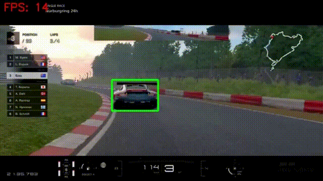

# Cascade_Toolbox
This is a toolbox to train, test, and run HAAR/LBP cascade easily. 

## Dependencies
- C++17
- Cmake: ``` sudo apt install cmake ```
- Zenity: ``` sudo apt install zenity ```
- OpenCV (versions 2 or 3): ``` sudo apt install libopencv-dev ```
- [Simd](https://github.com/ermig1979/Simd) (Optional)

## How to build?
```
git clone https://github.com/zanazakaryaie/Cascade_Toolbox.git
cd Cascade_Toolbox
mkdir build && cd build
cmake ..
make
```
If you want to use Simd library to accelerate the detection, replace the cmake command by:
```
cmake -DBUILD_SIMD_INFERENCE=ON -DSIMD_LIBRARY_PATH=~/Simd ..
```
## How to use?
Run the generated executables in the build folder following this order:

1. **collect_train_data**
    <br />Input: a training video (.mp4 or .avi)
    <br />Instructions: draw and edit positive boxes with mouse (no need to draw negatives), press space to move to the next frames
    <br />Output: Positive and Negative folders that contain sample images
    <br />
    
2. **collect_test_data**
    <br />Input: a testing video (.mp4 or .avi)
    <br />Instructions: draw and edit positive boxes with mouse, press space to move to the next frames
    <br />Output: a folder that contain .txt annotations of each frame
    
3. **train**
    <br />Input: configs.yaml file, Positive and Negative folders
    <br />Instructions: just wait for the training to finish
    <br />Output: trained model in .xml format
    
4. **test**
    <br />Input: the testing video, the testing directory (output of 2), and the trained .xml model 
    <br />Output: prints the Precision and Recall of the trained detector 
   
5. **hard_negative_mine**
    <br />Input: the training video, the trained .xml model
    <br />Instructions: right-click in false positives, press space to move to the next frames.
    <br />Output: new negative images added to the Negative folder

6. **train**
    <br />This is for including hard negatives and training a more accurate model. 

7. **inference** or **inference_simd** (if linked with Simd library)
    <br />Input: a video (.mp4 or .avi) and the trained .xml model
    <br />Output: the video played with detected objects and FPS
    <br />
    
## Appendix
For more details read my posts on [cascade algorithm](http://imrid.net/?p=4367) and [training a cascade model](http://imrid.net/?p=4378)


